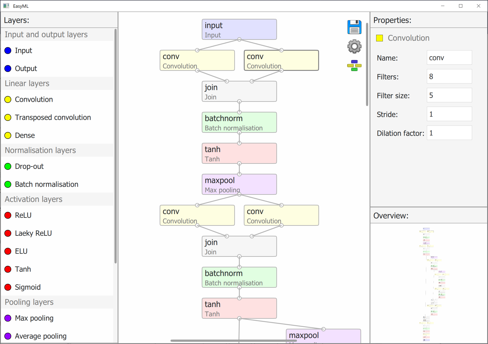
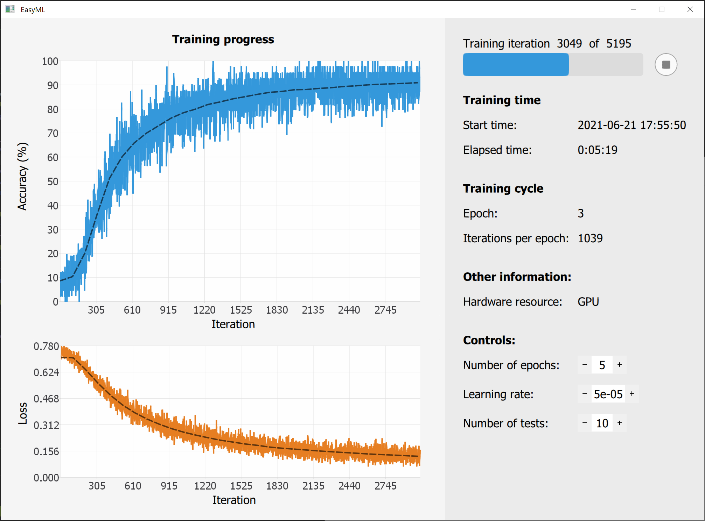
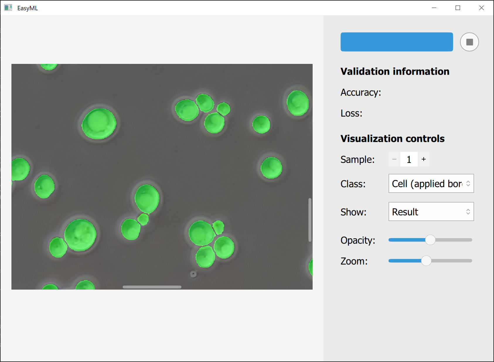

# MLGUI.jl
[](https://www.paypal.com/donate/?hosted_button_id=EJ2J3BVKYPJPY)

This package allows for convenient use of machine learning in Julia.

NB! This is a pre-alpha version. Bugs and rapid changes should be expected! Release is currently scheduled for February 2021. 

### Features
We use Flux.jl neural network library. Currently it is possible to:
  - Design a neural network
  - Train a neural network
  - Validate a neural network
  - Analyse data with a neural network
  
Only image data and image segmentation is currently supported.

### Usage 

#### Setting up
Clone the repository and then run
```
# Start a distributed process
using Distributed
if nprocs() < 2
    addprocs(1)
end
# Add MLGUI module to all workers
@everywhere include("MLGUI.jl")
@everywhere using .MLGUI

```
#### Model creation
A struct named ```model_data``` is exported.

- ```input_size::Tuple{Int64,Int64,Int64}```: input size during training (do not change manually)

- ```model::Chain```: Flux.jl model (do not change manually)

- ```layers::Dict```: contains layers and their information for visualisation (do not change manually)

- ```features::Vector{Feature}```: hold information about features that a neural network outputs and what should be done with them

- ```loss::Function```: holds loss that is used during training


```Feature``` contains

- ```name::String```: name of a feature

- ```color::Vector{Float64}```: color of a feature

- ```border::Bool```: allows to train a neural network to recognize borders and better separate objects during post-processing

- ```parent::String```: adds this feature to the specified parent during training

- ```Output::Output_options```: not used anywhere yet

Run ```design_network()``` to open a GUI for neural network creation. Click a save icon to save your network to the workspace.



NB! A number of neurons for the final layer should equal to the number of features plus the number of borders.

```save_model(url::String)```: saves your model, use ```.model``` extension

```load_model(url::String)```: loads your model

```load_model()```: opens file dialog where you can locate your model

#### Training

```urls_inputs::Vector{String}, urls_labels::Vector{String} = get_urls(url_inputs::String,url_labels::String)```: 
returns urls to all files present in both folders specified by ```url_inputs``` and ```url_labels```.

```data_inputs, data_labels = prepare_training_data(urls_inputs,urls_labels)```: prepares your images and corresponding labels for training

```results = train(data_inputs,data_labels)```: trains your neural network and opens a training window



Training parameters can be changed by running ```change_training_options()```.

#### Validation

```data = prepare_validation_data(urls_inputs,urls_labels)```: prepares your data for validation

```results = validate(data)```: opens validation window and returns results with information about accuracies and losses.



#### Analysis

```urls_inputs::Vector{String} = get_urls(url_inputs::String)```: 
returns urls to all files present in a folders specified by ```url_inputs```.

```data = prepare_analysis_data(urls_inputs)```: prepares your images for analysis

```
model = model_data.model
results = Vector{BitArray{3}}(undef,0)
for i = 1:length(data)
    output_raw = forward(model,data[i],num_parts=10)
    output_bool = output_raw[:,:,:].>0.5
    output = apply_border_data(output_bool)
    push!(results,output)
end
```
Results contain output data of a neural network. ```num_parts``` specifies in how many part should the image be run thorugh a neural network. 
Allows to process images that otherwise cause out of memory error.

```apply_border_data``` uses borders of objects that a neural network detected in order to separate objects from each other.


