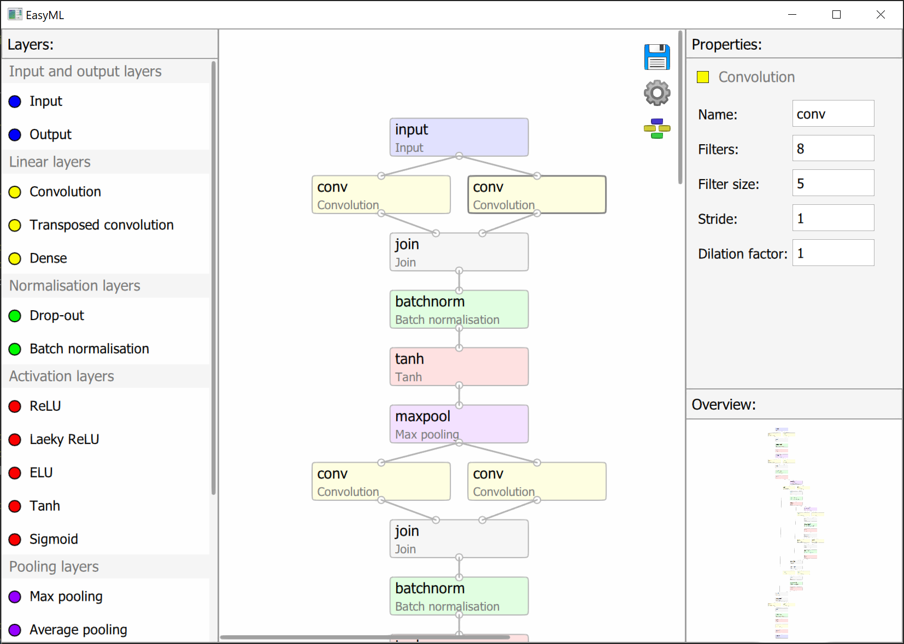

## Model design



```@raw html
<style>
.column1 {
  float: left;
}

.column2 {
    padding: 0.40em 0em 0em 2.8em;
}

.filler {
  float: left;
  width: 100%;
  height: 100px
  margin-bottom: 10em;
}

row::after{
   content: "";
  clear: both;
  display: table;
}

</style>
<div class="row">
    <div class="column1">
        <div>
            
        </div>
        <div>
            
        </div>
        <div>
            
        </div>
    </div class="column1">
  <div class="column2">
    <p>- saves your model</p>
    <p>- opens options for changing visual aspects.</p>
    <p>- arranges layers according to made connections.</p>
  </div class="column2">
</div class="row">
<div class="filler"></div class="filler">
```

## Adding classes

```@raw html

```

Name - name of a class. It is just for your convenience.

Weight - used for weight accuracy during training and validation. Calculated automatically during data preparation based on the frequency of classes. Can be also specified manually.

Parent - adds a class to the specified parent.

Parent 2 - appears if the first parent is specified. Adds a class to the specified parent.

Color (RGB) - RGB color of a class, which should correspond to its color on your images. Uses 0-255 range.

Overlap of classes - specifies that a class is an overlap of two classes and should be just added to specified parents.

Border is important - makes a separate class during training which detects borders of the current class.

Border thickness - specifies thickness of a border that should be detected.

Ignore object with a broken border - removes objects that do not have a closed border during application of a model.

Minimum object area - removes objects that have area smaller than specified.

## Output options

```@raw html

```

Output mask - exports a mask after applying all processing except for border data.

Border mask - exports a mask with class borders if a class has border detection enabled.

Applied border mask - exports a mask also processed using border data.

```@raw html

```

Area distribution - exports area distribution of detected objects as a histogram.

Area of objects - exports area of each detected object.

Sum of areas of objects - exports sum of all areas for each class.

Binning method - specifies a binning method: automatic, number of bins or bin width.

Value - number of bins or bin width depending on a previous settings.

Normalisation - normalisation type for a histogram: pdf, density, probability or none.

```@raw html

```

All is the same as for area.

## Training options

```@raw html

```

Allow GPU - allows to use a GPU if a suitable one is installed.

Weight accuracy - uses weight accuracy where applicable.

Mode - either Auto or Manual. Manual allows to specify weights manually for each class.

```@raw html

```

Data preparation mode - Either Auto or Manual. Auto takes a specified fraction of training data to be used for testing. Manual allows to use other data as testing data.

Test data fraction - a fraction of data from training data to be used for testing if data preparation mode is Auto.

Number of test - a number of tests to be done each epoch at equal intervals.

```@raw html

```

Convert to grayscale - converts images to grayscale for training, validation and application.

Mirroring - augments data by producing horizontally mirrored images.

Rotation -  augments data by rotating images using a specified number of angles. 1 means no rotation, only an angle of 0.

Minimum fraction of labeled pixels -  if supplied images are bigger than a model's input size, then an image is broken into chunks with a correct size. This option specifies the minimum number of labeled pixels for these chunks to be kept.

```@raw html

```

Optimiser - an optimiser that should be used during training. ADAM usually works well for all cases.

Next are parameters specific for each optimiser.

Batch size - a number of images that should be batched together during training.

Number of epochs - a number of rounds for which a model should be trained.

Learning rate - specifies how fast a model should train. Lower values - more stable, but slower. Higher values - less stable, but faster. Should be decreased as training progresses.

## Aplication options

```@raw html

```

Save path - a folder where output data should be saved.

Analyse by - either file or folder. Used for segmentaion. Analysis by file treats every image independently. Analysis by folder combines data for images in the same folder.

Output data type - a format in which data should be saved.

Output image type - a format in which images should be saved.

Scaling - used for segmentation. Converts pixels to a unit of measurment of your choice.
