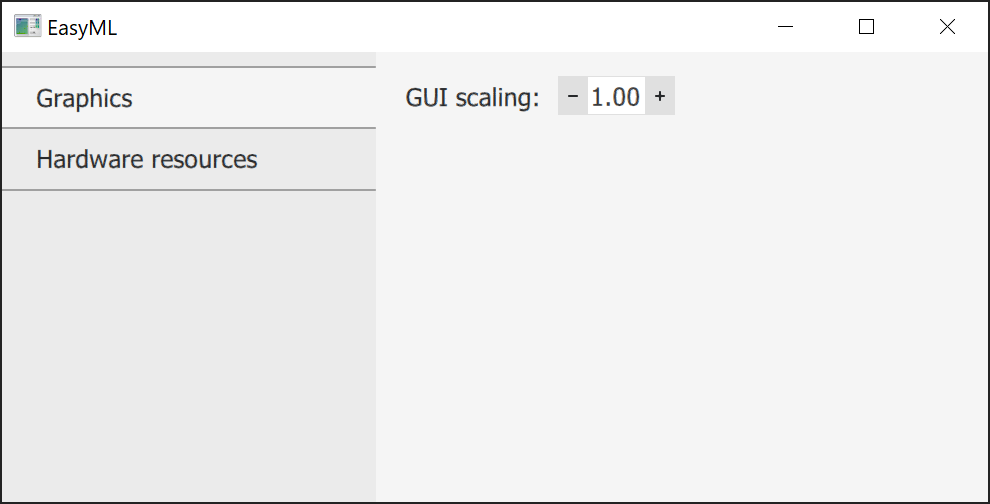
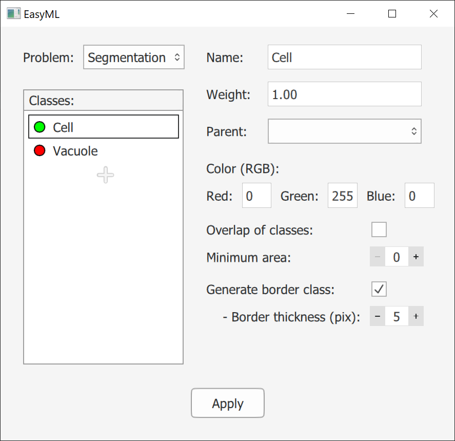
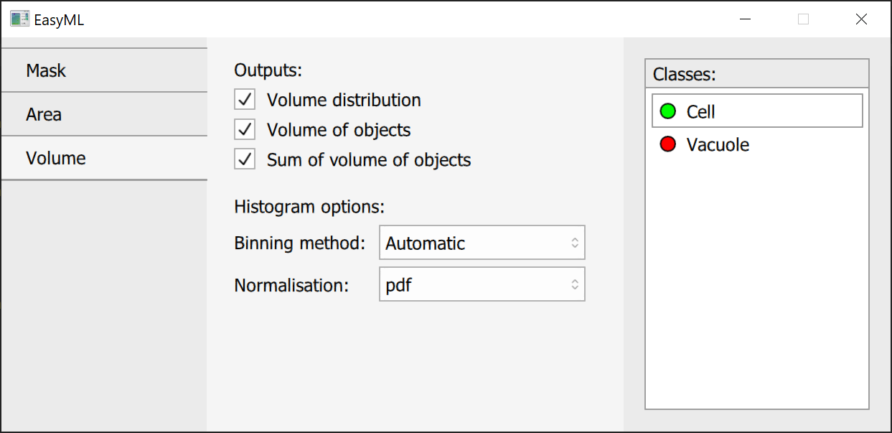
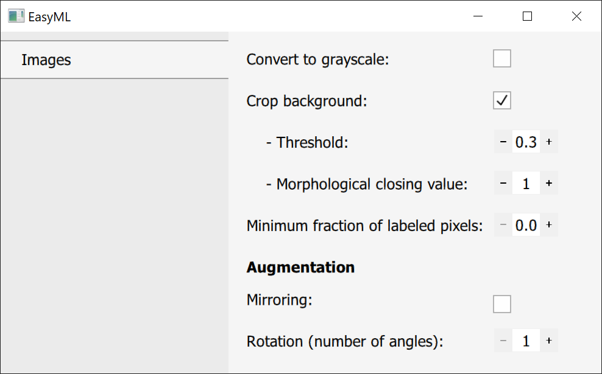
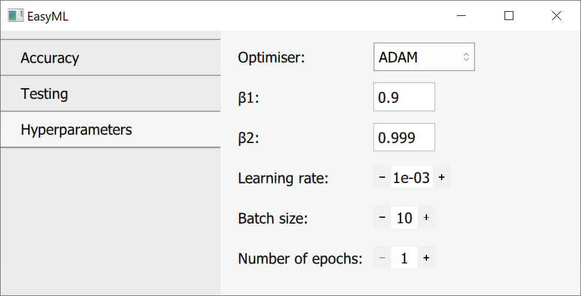
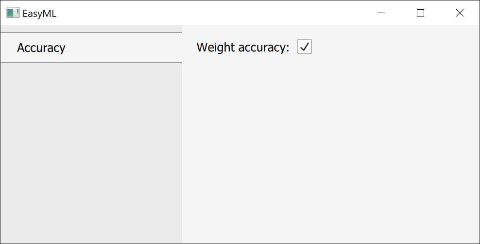

## Global options

```@raw html


<p><par class="definition">GUI scaling</par> - scales GUI by a given factor.</p>
```

```@raw html


<p><par class="definition">Allow GPU</par> - allows to use a GPU if a compatible one is installed.</p>

<p><par class="definition">Number of threads</par> - a number of CPU threads that will be used.</p>

<p><par class="definition">Number of slices</par> - allows to process images during validation and application that otherwise cause an out of memory error by slicing them into multiple parts. Used only for segmentation.</p>

<p><par class="definition">Offset</par> - offsets each slice by a given number of pixels to allow for an absence of a seam. </p>
```

## Adding classes

```@raw html

```
```@raw html
<style> 
.definition{
  color: rgb(231,76, 60);
  font-weight: bold;
}

</style>
<p><par class="definition">Name</par> - name of a class. It is just for your convenience.</p>

<p><par class="definition">Weight</par> - used for weight accuracy during training and validation. 
Calculated automatically during data preparation based on the frequency of classes. Can be also specified manually.</p>

<p><par class="definition">Parent</par> - adds a class to the specified parent.</p>

<p><par class="definition">Parent 2</par> - appears if the first parent is specified. Adds a class to the specified parent.</p>

<p><par class="definition">Color (RGB)</par> - RGB color of a class, which should correspond to its color on your images. Uses 0-255 range.</p>

<p><par class="definition">Overlap of classes</par> - specifies that a class is an overlap of two classes and should be just added to specified parents.</p>

<p><par class="definition">Minimum area</par> - removes objects that have area smaller than specified.</p>

<p><par class="definition">Generate border class</par> - prepares labels with object borders during data preparation and uses them for training.</p>

<p><par class="definition">Border thickness</par> - specifies thickness of a border in pixels.</p>

```

## Output options

```@raw html


<p><par class="definition">Output mask</par> - exports a mask after applying all processing except for border data.</p>

<p><par class="definition">Border mask</par> - exports a mask with class borders if a class has border detection enabled.</p>

<p><par class="definition">Applied border mask</par> - exports a mask also processed using border data.</p>

```

```@raw html


<p><par class="definition">Area distribution</par> - exports area distribution of detected objects as a histogram.</p>

<p><par class="definition">Area of objects</par> - exports area of each detected object.</p>

<p><par class="definition">Sum of areas of objects</par> - exports sum of all areas for each class.</p>

<p><par class="definition">Binning method</par> - specifies a binning method: automatic, number of bins or bin width.</p>

<p><par class="definition">Value</par> - number of bins or bin width depending on previous settings.</p>

<p><par class="definition">Normalisation</par> - normalisation type for a histogram: pdf, density, probability or none.</p>
```

```@raw html

```

All is the same as for area.

## Model design


```@raw html
<style>
.column1 {
  float: left;
}

.column2 {
    padding: 0.40em 0em 0em 2.8em;
}

.filler {
  float: left;
  width: 100%;
  height: 100px
  margin-bottom: 10em;
}

row::after{
   content: "";
  clear: both;
  display: table;
}

</style>
<div class="row">
    <div class="column1">
        <div>
            
        </div>
        <div>
            
        </div>
        <div>
            
        </div>
    </div class="column1">
  <div class="column2">
    <p>- saves your model</p>
    <p>- opens options for changing visual aspects</p>
    <p>- arranges layers according to made connections</p>
  </div class="column2">
</div class="row">
<div class="filler"></div class="filler">
```

## Data preparation options

```@raw html


<p><par class="definition">Convert to grayscale</par> - converts images to grayscale for training, validation and application.</p>

<p><par class="definition">Crop background</par> - crops uniformly dark areas. Finds the last column from left and right and row from bottom and top to be uniformly dark.</p>

<p><par class="definition">Threshold</par> - creates a mask from values less than threshold.</p>

<p><par class="definition">Morphological closing value</par> - value for morphological closing which is used to smooth the mask.</p>

<p><par class="definition">Minimum fraction of labeled pixels</par> -  if supplied images are bigger than a model's input size, then an image is broken into chunks with a correct size. This option specifies the minimum number of labeled pixels for these chunks to be kept.</p>

<p><par class="definition">Mirroring</par> - augments data by producing horizontally mirrored images.</p>

<p><par class="definition">Rotation</par> -  augments data by rotating images using a specified number of angles. 1 means no rotation, only an angle of 0.</p>


```

## Training options

```@raw html


<p><par class="definition">Weight accuracy</par> - uses weight accuracy where applicable.</p>

<p><par class="definition">Mode</par> - either auto or manual. manual allows to specify weights manually for each class.</p>
```

```@raw html


<p><par class="definition">Data preparation mode</par> - either auto or manual. auto takes a specified fraction of training data to be used for testing. Manual allows to use other data as testing data.</p>

<p><par class="definition">Test data fraction</par> - a fraction of data from training data to be used for testing if data preparation mode is Auto.</p>

<p><par class="definition">Number of test</par> - a number of tests to be done each epoch at equal intervals.</p>
```

```@raw html


<p><par class="definition">Optimiser</par> - an optimiser that should be used during training. ADAM usually works well for all cases.</p>

<p>Next are parameters specific for each optimiser.</p>

<p><par class="definition">Learning rate</par> - specifies how fast a model should train. Lower values - more stable, but slower. Higher values - less stable, but faster. Should be decreased as training progresses.</p>

<p><par class="definition">Batch size</par> - a number of images that should be batched together during training.</p>

<p><par class="definition">Number of epochs</par> - a number of rounds for which a model should be trained.</p>
```

## Validation options

```@raw html


<p><par class="definition">Weight accuracy</par> - uses weight accuracy where applicable.</p>
```

## Application options

```@raw html


<p><par class="definition">Save path</par> - a folder where output data should be saved.</p>

<p><par class="definition">Analyse by</par> - either file or folder. Used for segmentation. Analysis by file treats every image independently. Analysis by folder combines data for images in the same folder.</p>

<p><par class="definition">Output data type</par> - a format in which data should be saved.</p>

<p><par class="definition">Output image type</par>Output image type - a format in which images should be saved.</p>

<p><par class="definition">Scaling</par> - used for segmentation. Converts pixels to a unit of measurement of your choice.</p>
```