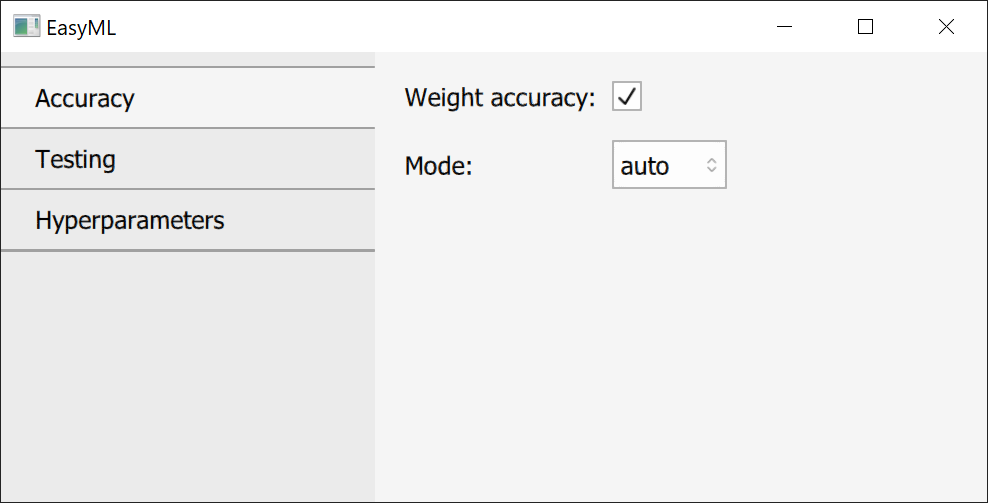
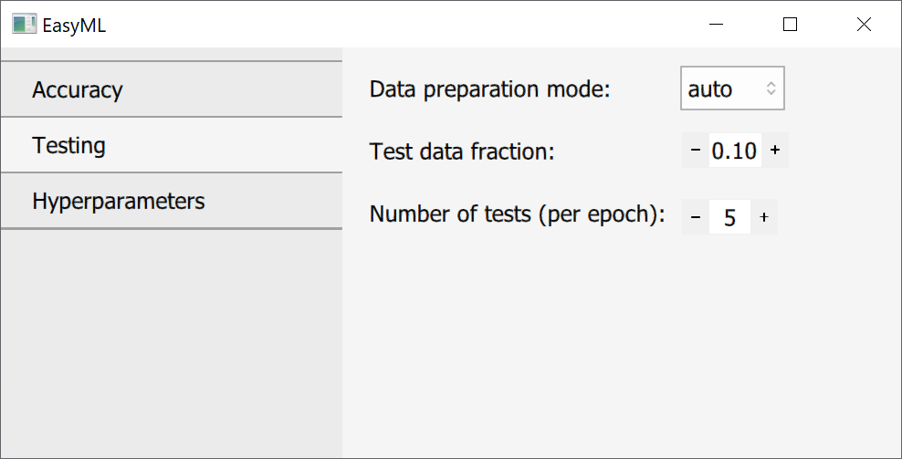

## Training options


```@raw html
<style> 
.definition{
  color: rgb(231,76, 60);
  font-weight: bold;
}
</style> 
```

```@raw html


<p><par class="definition">Weight accuracy</par> - uses weight accuracy where applicable.</p>

<p><par class="definition">Mode</par> - either Auto or Manual. Manual allows to specify weights manually for each class.</p>
```

```@raw html


<p><par class="definition">Data preparation mode</par> - either Auto or Manual. Auto takes a specified fraction of training data to be used for testing. Manual allows to use other data as testing data.</p>

<p><par class="definition">Test data fraction</par> - a fraction of data from training data to be used for testing if data preparation mode is Auto.</p>

<p><par class="definition">Number of test</par> - a number of tests to be done each epoch at equal intervals.</p>
```

```@raw html


<p><par class="definition">Optimiser</par> - an optimiser that should be used during training. ADAM usually works well for all cases.</p>

<p>Next are parameters specific for each optimiser.</p>

<p><par class="definition">Learning rate</par> - specifies how fast a model should train. Lower values - more stable, but slower. Higher values - less stable, but faster. Should be decreased as training progresses.</p>

<p><par class="definition">Batch size</par> - a number of images that should be batched together during training.</p>

<p><par class="definition">Number of epochs</par> - a number of rounds for which a model should be trained.</p>
```
