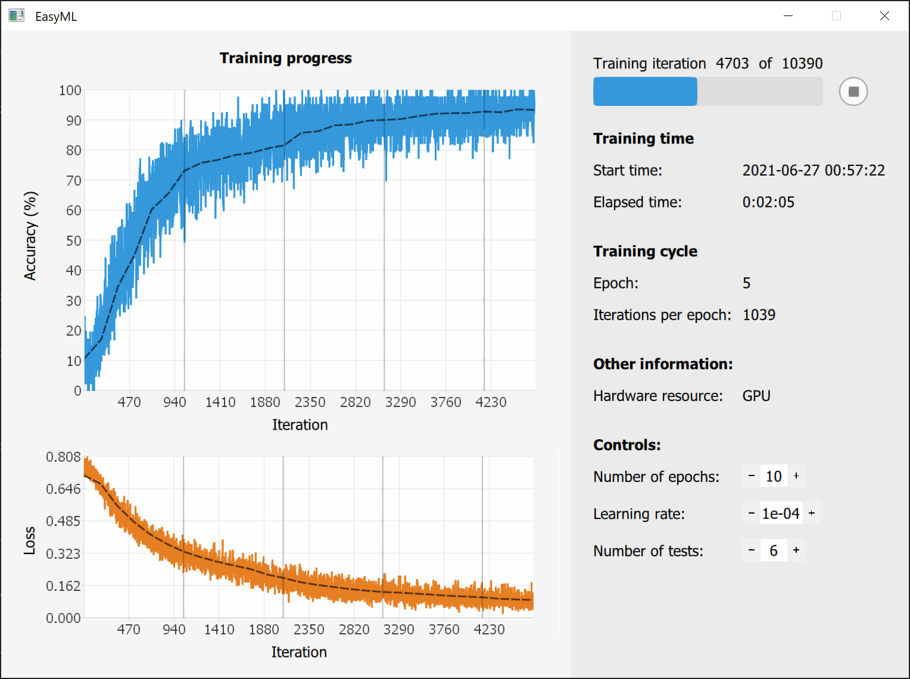
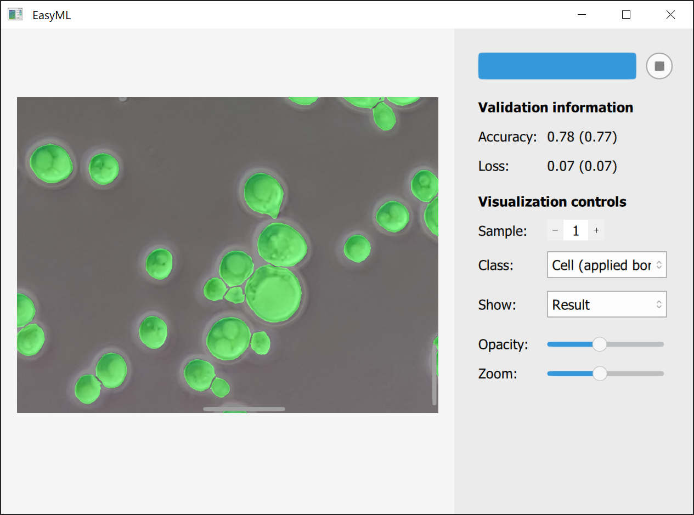

## Package features

This package allows to use machine learning in Julia through a graphical user interface.

It is possible to:
  - Design a neural network
  - Train a neural network
  - Validate a neural network
  - Apply a neural network to new data
  
Classification, regression and segmentation on images are currently supported.

[Flux.jl](https://github.com/FluxML/Flux.jl) machine learning library is used under the hood.

```@raw html
<style>

.column1 {
  float: left;
  width: 34%;
  padding: 0.25%;
}

.column2 {
  float: left;
  width: 32.5%;
  padding: 0.25%;
}

.column3 {
  float: left;
  width: 32.75%;
  padding: 0.25%;
}

.filler {
  float: left;
  width: 100%;
  margin-bottom: 0.6em;
}

row::after{
   content: "";
  clear: both;
  display: table;
}

</style>
<div class="row">
  <div class="column1">
    
  </div>
  <div class="column2">
    
  </div>
  <div class="column3">
    
  </div>
</div>
<div class="filler">
</div>
```

## Installation

Run `] add EasyML` in REPL.